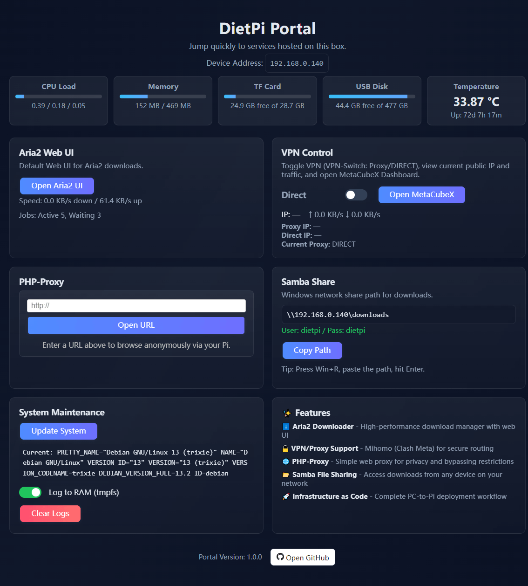

# 🍓 DietPi Download Station


**Automated NAS setup for NanoPi, Raspberry Pi, and other SBCs with Aria2, VPN (Mihomo/Clash Meta), and Samba.**

This project turns a low-cost Single Board Computer (NanoPi NEO/NEO2, Raspberry Pi, Orange Pi, etc.) into a powerful headless download station with a web-based management portal, VPN support, and network file sharing. All deployment and management is performed from your PC—no manual SSH required after initial setup.


## 🖼️ Demo Screenshot

<p align="center">
    
</p>


## ✨ Features

- **Aria2 Downloader** – High-performance download manager (systemd service)
- **VPN/Proxy Support** – Mihomo (Clash Meta) for secure routing
- **Samba File Sharing** – Access downloads from any device on your network
- **Web Management Portal** – Real-time system status, logs, and service control
- **USB Storage** – Auto-mount with persistent downloads
- **PC-Driven Workflow** – All deployment and management from your PC
- **Infrastructure as Code** – Version-controlled configs, repeatable deployments

## 🚀 Quick Start

### 1. Download & Flash DietPi Image
Download the correct DietPi image for your device from https://dietpi.com/downloads/images/
    - For NanoPi NEO: `DietPi_NanoPiNEO-ARMv7-Bookworm.img.xz`
    - For NanoPi NEO2: `DietPi_NanoPiNEO2-ARMv8-Trixie.img.xz`

Flash to TF card using Etcher (Windows/macOS/Linux) or Win32DiskImager (Windows).

### 2. Copy dietpi.txt (and Optional Pre-Script) to Boot Partition
After flashing, copy `dietpi.txt` from the project root to the boot partition of the SD card. 

**If you are in China or need to bypass GitHub blocks, also copy `Automation_Custom_PreScript.sh` to the boot partition.**

(Use PowerShell, Finder, or your file manager.)


### 3. Boot the Pi
- Insert TF card into NanoPi
- Connect USB drive
- Connect Ethernet cable
- Power on
- **Wait 5-10 minutes** for DietPi auto-install

### 4. First SSH Login (Required)
After boot, SSH into your Pi for the first time using the default credentials:
```bash
ssh root@<your-pi-ip>
```
The default password is `dietpi`.

On first login, DietPi may prompt for password changes or run its setup wizard. Complete any required interaction. Once setup finishes, you can disconnect and continue with automated scripts (including running ssh-copy-id to set up key-based authentication).

### 4. Find Pi IP Address
Check your router's DHCP client list for a device named "DietPi".

### 5. Setup SSH Keys
Generate SSH key pair and create the config file:
```bash
ssh-keygen -t rsa -b 4096 -f dietpi.pem -C "dietpi-nanopi"
cp pi.config.example pi.config
# Edit pi.config with your Pi's IP address
```
Copy your public key to the Pi (first time only, password: "dietpi"):
```bash
ssh-copy-id -i dietpi.pem.pub root@192.168.1.100
```

### 6. Verify SSH Connection
If you get a "REMOTE HOST IDENTIFICATION HAS CHANGED" warning (after reflashing or reusing an IP):
ssh-keygen -R 192.168.1.100

# First SSH connection to DietPi
ssh -i dietpi.pem root@192.168.1.100

# On first login, DietPi will run its first-run setup wizard:
# 1. Accept/update global password (default: "dietpi")
# 2. Wait for software installation to complete (5-10 minutes)
# 3. Setup completes automatically (services start)
# 4. You'll see the DietPi banner and command prompt

# Note: dietpi.txt has CONFIG_CHECK_DIETPI_UPDATES=2 to skip GitHub update checks
# during first boot (avoiding connectivity issues). You can update manually later
# using the Update System button on the web portal or run: dietpi-update

# After first login succeeds, type 'exit' to disconnect
# Subsequent connections will be immediate (no wizard)
```


### 7. Deploy to Pi
Install assets and deploy configurations:
```bash
./setup.sh
./deploy.sh
./status.sh
```

### 8. Access Services
- **Portal**: http://192.168.1.100/
 
- **Samba**: `\\192.168.1.100\downloads` 
Samba User name: dietpi
Samba Password: dietpi

### 9. Update VPN Subscription (MetaCubeX/Mihomo)
To fetch the latest Clash/Mihomo subscription config for MetaCubeX:
```bash
./SubscriptionVPN.sh "https://your-provider-subscription-url.com"
# This saves to ./local_configs/subscription.yaml by default
```
You can also download manually:
```bash
curl -sSL -H "User-Agent: clash" "https://your-provider-subscription-url.com" -o ./local_configs/subscription.yaml
```
`deploy.sh` will automatically deploy `local_configs/subscription.yaml` to `/etc/mihomo/providers/subscription.yaml` on your Pi. You can edit or update the file anytime and re-run `deploy.sh`.

> ⚠️ Some providers require the `User-Agent: clash` header to return a full config, not just a node list.


## 📁 Project Structure

```
DietPi-NanoPi/
├── dietpi.txt              # DietPi auto-install config
├── pi.config.example       # SSH connection template
├── setup.sh                # Install assets to Pi
├── deploy.sh               # Deploy configs to Pi
├── download.sh             # Download configs from Pi
├── update_configs.sh       # Regenerate local configs
├── status.sh               # Check Pi status
│
├── assets/                 # Binaries & web files
│   ├── binaries/           # mihomo, country.mmdb, geosite.dat
│   ├── web/                # index.html, api/
│   └── templates/          # config.yaml
│
├── local_configs/          # Deployed configurations
│   ├── aria2.conf
│   ├── nginx.conf
│   ├── smb.conf
│   ├── index.html
│   ├── mihomo.service
│   ├── aria2.service
│   └── ...
│
└── docs/                   # Documentation
    ├── RUNBOOK.md          # Detailed setup guide
    ├── PROJECT_CONTEXT.md  # Architecture overview
    └── ...
```


## 🔄 Development Workflow

```bash
# Edit configs locally
nano local_configs/aria2.conf

# Deploy changes
./deploy.sh

# Check status
./status.sh

# Repeat as needed
```
All operations run from your PC—no manual SSH needed after initial setup!


## 📖 Documentation

- **[docs/RUNBOOK.md](docs/RUNBOOK.md)** – Complete setup and troubleshooting guide
- **[docs/PROJECT_CONTEXT.md](docs/PROJECT_CONTEXT.md)** – Architecture and design principles
- **[assets/README.md](assets/README.md)** – Asset download links and instructions
- **[local_configs/README.md](local_configs/README.md)** – Configuration management workflow


## 🛠️ Requirements


**Hardware:**
- NanoPi NEO or NEO2 (ARMv7/ARMv8) or compatible SBC
- TF card (8GB+ recommended)
- USB storage device (**must be formatted as exFAT** for auto-mount and download storage; ext4 is also supported, NTFS is not supported by the automated scripts)
# ⚠️ USB Drive Format Requirement

> **Important:** Your USB drive must be formatted as exFAT (recommended) or ext4 for the automated mount and download storage to work. NTFS is **not supported** by the deployment scripts and will cause mount errors.

If your USB drive is NTFS, reformat it as exFAT before running `./deploy.sh`. Back up your data first!

**How to format as exFAT (Linux):**
```bash
sudo apt install exfatprogs
sudo mkfs.exfat /dev/sdX1  # Replace sdX1 with your USB device
```
**How to format as exFAT (Windows/macOS):**
- Use Disk Management (Windows) or Disk Utility (macOS) and select exFAT as the filesystem.

If you see errors about "wrong fs type, bad option, bad superblock" during deployment, your drive is likely not exFAT or is corrupted.

**Software:**
- DietPi OS (Debian Bookworm based)
- PC with SSH client (Windows, macOS, or Linux)


## 📦 Installed Services

The `dietpi.txt` auto-installs:
- **OpenSSH** (105) – SSH server
- **Aria2** (132) – Download manager
- **Nginx** (85) – Web server
- **Samba** (96) – File sharing
- **PHP** (89) – Web scripting


## 🔐 Security

- SSH key-based authentication (no passwords)
- `dietpi.pem` and `pi.config` are **never committed** to git
- See [docs/RUNBOOK.md](docs/RUNBOOK.md) for security best practices


## 🤝 Contributing

Contributions welcome! Please:
1. Fork the repository
2. Create a feature branch
3. Test on actual hardware
4. Submit a pull request


## 📄 License

MIT License – See LICENSE file for details


## 🙏 Acknowledgments

- [DietPi](https://dietpi.com/) – Lightweight Debian OS
- [Aria2](https://aria2.github.io/) – Download utility
- [Mihomo](https://github.com/MetaCubeX/mihomo) – Clash Meta core

---

gh repo create lishuren/DietPi-NanoPi --public --source=. --remote=origin --push
# Option B: manual remote + push
git remote add origin https://github.com/lishuren/DietPi-NanoPi.git
git branch -M main
git push -u origin main

**Star ⭐ this repo if you find it useful!**
